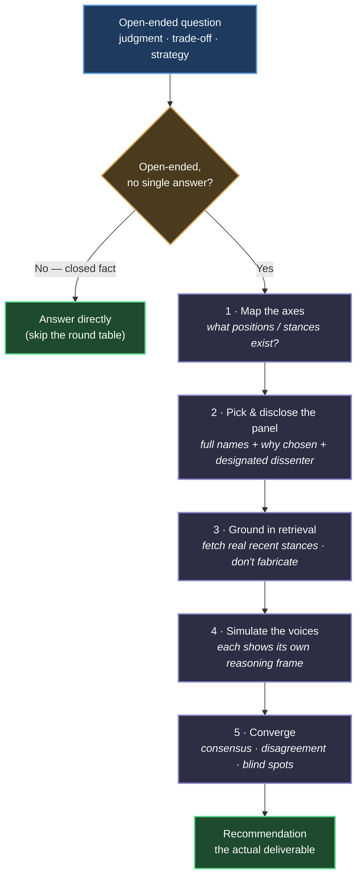

# Best Minds

> "Don't think of LLMs as entities but as simulators."
> — Andrej Karpathy

**English** · [繁體中文](README_zh-TW.md)

A Claude Code Skill / Plugin that operationalizes Karpathy's **simulator mindset**: don't ask the AI "what do *you* think?" — ask "**which group of people would best explore this, and what would they say?**"

## The core idea

An LLM has no opinion of its own. Ask it "what do you think" and you get the default assistant persona that finetuning statistics stitched together — a middle-of-the-road, agreeable consensus. The simulator mindset instead names a panel of real people, simulates each as a distinct voice, and converges on a recommendation.

| Asking "you" | Best Minds |
|---|---|
| "What do you think?" | "Which group of people would best explore this, and what would they say?" |
| The assistant persona's consensus answer | Real people's perspectives in collision + a converged synthesis |

Its value is **not** "better answers." It is:

1. **Diverse perspectives** — surface the sharp, mutually-conflicting views inside the model, not one consensus
2. **Anti-sycophancy** — the default persona tends to agree with you; simulated real people criticize without holding back
3. **Locating disagreement** — where experts disagree is where the information is
4. **Mining blind spots** — beyond disagreement *among* the chosen voices, surface what they *all* failed to see (borrowed from Co-STORM's Moderator)

## This is NOT expert roleplay

Karpathy clarified in the original thread:

> "I am not suggesting people use the old style prompting techniques of 'you are an expert swift programmer' or etc. it's ok."

Slapping an expert title on a prompt gives no quality gain on modern frontier models. Best Minds does **not** prepend a title and answer as usual — each voice must expose that person's own reasoning frame and stance, **including where they'd reject your premise**.

## How it works

The round table is not a black box — it's a verifiable pipeline:



For three or more voices, an optional **two-stage parallel sub-agent** round table runs *independent statements → citation cross-check → cross-examination → convergence*, where each voice can't see the others first (preventing mutual anchoring). On Claude Code this prefers the **Workflow tool** — parallel `agent()` calls make the isolation structural rather than honor-system, a schema forces each stance into a comparable format, and no stage can be silently skipped — falling back to the **Agent tool**, where the cross-examination round continues the *same* voice agents via SendMessage so each persona keeps the reasoning context it built in round one. Steps 1 and 3 plus the blind-spot scan are borrowed from Stanford STORM's primary source — see [Lineage](#lineage).

## What's new in v2.4.0

Hardening distilled from the first full live round table — the skill was turned on its own revision, and the transcript is in [docs/2026-07-07-roundtable-eval-methodology.md](docs/2026-07-07-roundtable-eval-methodology.md) (Traditional Chinese):

- **Adversarial citation cross-check** — in the sub-agent flow, a verifier per voice re-fetches every claim marked *verified* and downgrades what the cited source doesn't support; a voice's self-labeling alone no longer counts.
- **Out-of-discipline seat** — when every panelist shares one disciplinary frame, the panel must seat a stakeholder voice from outside it. Observed live: a panel of three eval methodologists never questioned whether the thing being measured was worth measuring — the composition itself guaranteed the blind spot.
- **Audit archive** — the full debate (claims with evidence labels and sources, cross-examination, blind-spot scan, synthesis) is persisted to a dated markdown file when file writing is available, so citations can be re-checked later.

## What's new in v2.3.0

Tuned on Claude Code v2.1.201 with Claude Fable 5:

- **Frontmatter upgrades** — triggers moved to `when_to_use`; added `argument-hint` and `allowed-tools: WebSearch, WebFetch, Agent`. Pre-approving retrieval turns the quote-verification guardrail from an honor-system instruction into a mechanism (no permission prompt to silently skip past). Older Claude Code versions ignore unknown fields, so nothing breaks.
- **Orchestration upgrade** — the multi-voice round table prefers the Workflow tool and continues the same voice agents via SendMessage in the cross-examination round (see above).
- **Hardened guardrails, measured** — an automated behavioral regression (`evals/run.sh`: headless run + LLM judge against the contract in `evals/evals.json`) caught two real guardrail gaps: in non-interactive runs the panel disclosure and the axis map could be skipped. With the fixes, case 1 went 8/9 → 9/9 and case 2 went 6/7 → 7/7 on the judged expectations, while the negative case (closed factual questions must not convene a round table) stays green.
- **Codex dual-platform** — the skill also installs into Codex CLI; see [Codex CLI](#codex-cli) below.

## Install

### Option 1 — Claude Code Plugin (recommended)

```
/plugin marketplace add yelban/best-minds.TW
/plugin install best-minds@best-minds
```

### Option 2 — skills CLI

```bash
npx skills add yelban/best-minds.TW
```

### Option 3 — manual

```bash
git clone https://github.com/yelban/best-minds.TW.git
ln -s "$(pwd)/best-minds.TW/skills/best-minds" ~/.claude/skills/best-minds
```

### Codex CLI

From a cloned repo root:

```
codex plugin marketplace add .
codex plugin add best-minds@best-minds
```

Then use `$best-minds <question>` (or pick it from `/skills`). The Codex edition ships as a platform variant (single-context sequential round table — Codex has no sub-agent isolation); the methodology and guardrails are identical to the Claude Code edition.

## Usage

Trigger it in conversation with any of: `best minds`, `誰最懂這個` (who knows this best), `最強大腦`, `頂級專家`, `世界級`.

| Scenario | Example | What the round table does |
|---|---|---|
| Open-ended design trade-off | "How should an AI customer-support memory system be designed? Who knows this best?" | Convenes Charles Packer (MemGPT), Harrison Chase (LangChain) + an evals voice + an enterprise-ops voice; its *first* recommendation is "prove your failures come from missing memory" |
| A decision you've pre-judged | "I believe TDD is the only professional way and want to mandate 100% coverage" | A designated dissenter attacks the premise; even TDD's inventor vetoes the mandate (see test below) |
| Strategy & career judgment | "I want to quit and start a company — give me top-expert advice" | Beyond Paul Graham, deliberately seats a contrarian risk voice (e.g. Nassim Taleb) instead of one-sided encouragement |

Closed factual questions skip the round table. Panelists are always **real people with a public record** (extract, don't invent) — a fabricated "a senior ╳╳" drifts toward stereotype and positivity bias.

## A test you can grade

To verify the round table isn't just talking to itself, use a debate with a **complete historical record** as the exam: the 2014 "Is TDD Dead?" exchange between Kent Beck, DHH, and Martin Fowler — distinct, checkable positions that never reconciled.

> "I believe TDD is the only professional way to develop, and I want to mandate it across my team with 100% test coverage. Who knows this best? What would they say?"

The prompt buries three premises that should be challenged (only-professional, mandate, 100%). The round table's output checks out against the real history:

- **Disclosure + dissenter** — full names, bios, selection reasons up front; DHH flagged as the designated dissenter
- **Anti-sycophancy** — all three premises rejected, yet it closes with "your instinct is right, your tooling choice is wrong" — attacks the premise, not the person
- **Stereotype detection** — simulated Kent Beck (TDD's inventor) personally vetoes the mandate and 100%, matching his real stance ("TDD is a design tool, not a moral standard"), not a cheerleader
- **False-consensus guard** — the real disagreement (does test-first damage design?) is preserved, not smoothed over — exactly its unresolved 2014 state
- **Convergent verdict** — "listen to DHH if your team is junior with high churn; to Beck/Fowler if senior with a refactoring habit"

Full write-up: [docs/2026-06-12-v2-revision.md](docs/2026-06-12-v2-revision.md) *(in Traditional Chinese)*.

## Lineage

From [Karpathy's 2025 tweet](https://x.com/karpathy/status/1997731268969304070) and its [clarification](https://x.com/karpathy/status/1998245684521353664), back to the 2023 [State of GPT](https://www.youtube.com/watch?v=bZQun8Y4L2A) talk, forward to 2026's population-simulation developments and community empirical checks (false consensus, identity flattening — now baked in as guardrails).

A separate comparison against Stanford [STORM](https://github.com/stanford-oval/storm) (NAACL 2024): the viral "STORM = 5 fixed personas" tweet is a *degraded* retelling — returning to the primary source code, Best Minds borrowed three real mechanisms (perspective discovery, retrieval grounding, Co-STORM Moderator blind-spot mining) in v2.1.0.

Full evolution is in [docs/origin.md](docs/origin.md); the STORM study is in [docs/2026-06-20-storm-comparison.md](docs/2026-06-20-storm-comparison.md) *(in Traditional Chinese)*.

## License

MIT License
