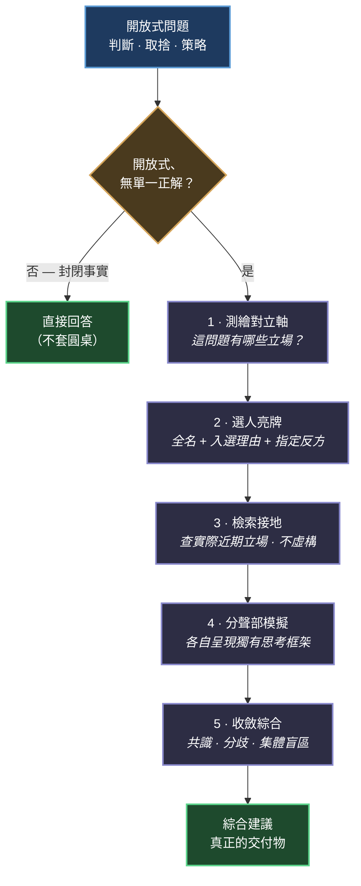

# Best Minds

> "Don't think of LLMs as entities but as simulators."
> — Andrej Karpathy

[English](README.md) · **繁體中文**

一個 Claude Code Skill / Plugin，實作「模擬器思維」方法論：不問 AI「你怎麼看」，改問「**世界上哪群人最適合探討這個？他們會怎麼說？**」

## 核心理念

LLM 沒有「自己的看法」。當你問「你怎麼看」，得到的是 finetuning 資料統計拼出的預設助理人格——中庸、傾向附和的共識答案。模擬器思維改為指定真實人物的視角組合，分聲部模擬，最後收斂成建議。

| 傳統問法 | Best Minds 問法 |
|---------|----------------|
| 「你怎麼看？」 | 「世界上哪群人最適合探討這個？他們會怎麼說？」 |
| 預設助理人格的共識答案 | 多位真實人物的視角碰撞 + 收斂綜合 |

它的價值不在「答得更好」，而在：

1. **視角多元** — 取出模型內部有稜角、彼此衝突的真實觀點
2. **反諂媚** — 預設助理人格傾向附和；模擬的真實人物批評起來毫無顧忌
3. **定位分歧** — 專家們意見相左之處，正是資訊量所在
4. **挖掘盲區** — 不只找選中者之間的分歧，還挖全體共同沒看到的集體盲點（借鏡 Co-STORM Moderator）

## 這不是 expert roleplay

Karpathy 在原 thread 特別澄清：

> "I am not suggesting people use the old style prompting techniques of 'you are an expert swift programmer' or etc. it's ok."

「你是世界級專家」那種舊式提示在現代前沿模型上已無品質增益。本 skill 不是在答案前貼專家頭銜，而是讓每個聲部呈現那個人獨有的思考框架與立場——包括反對你前提的地方。

## 安裝

### 方式一：Claude Code Plugin（建議）

```
/plugin marketplace add yelban/best-minds.TW
/plugin install best-minds@best-minds
```

### 方式二：skills CLI

```bash
npx skills add yelban/best-minds.TW
```

### 方式三：手動

```bash
git clone https://github.com/yelban/best-minds.TW.git
ln -s "$(pwd)/best-minds.TW/skills/best-minds" ~/.claude/skills/best-minds
```

### Codex CLI

在 clone 下來的 repo 根目錄執行：

```
codex plugin marketplace add .
codex plugin add best-minds@best-minds
```

之後用 `$best-minds <問題>` 觸發（或從 `/skills` 選取）。Codex 版是平台變體（單 context 順序圓桌——Codex 沒有 subagent 隔離工具），方法論與護欄跟 Claude Code 版完全一致。

## 使用方式

在對話中使用觸發詞：

- 最強大腦
- 頂級專家
- 世界級
- best minds
- 誰最懂這個

### 適用場景

| 場景 | 例子 | 圓桌做什麼 |
|---|---|---|
| 開放式設計取捨 | 「AI 客服的記憶系統該怎麼設計？誰最懂這個？」 | 組 Charles Packer（MemGPT）、Harrison Chase（LangChain）加評估派與企業實務派交鋒；給出的第一條建議卻是「先證明你的失敗來自缺記憶」 |
| 帶著先驗結論的決策 | 「我相信 TDD 是唯一專業方式，要強制推行 100% 覆蓋率」 | 指定反方直攻前提；連 TDD 發明者都否決強制令（見下方實測） |
| 策略與職涯判斷 | 「我想辭職創業，請用頂級專家的視角給建議」 | Paul Graham 之外刻意放一位唱反調的風險視角（如 Nassim Taleb），不一面倒鼓勵 |

封閉的事實問題不套圓桌；人選一律用有公開言論記錄的真實人物（extract，不 invent）——捏造的「一位資深╳╳」會向刻板印象與正向偏誤漂移。

## 運作流程

圓桌不是黑箱，是一套可驗證的步驟：



1. **測繪對立軸** — 先看這問題有哪些立場光譜，避免選到共享同一盲點的人
2. **選人亮牌** — 列出人選全名、身分簡介、入選理由，並標出指定反方
3. **檢索接地** — 爭議／時效題先查當事人實際近期立場（查不到就明說是推測，不虛構）
4. **分聲部模擬** — 每位真實人物呈現獨有思考框架與具體主張，全程標明是模擬
5. **收斂綜合** — 標出共識、關鍵分歧、集體盲區，給依情境的裁決——而非「各有道理」式的表面平衡

三人以上可用平行 subagent 跑兩階段（獨立陳述 → 交鋒 → 收斂），各聲部彼此看不到對方，避免互相錨定。其中第 1、3 步與盲區掃描借鏡自 Stanford STORM 正源（見下方源流）。

## 實測：一題可以對答案的考題

驗證圓桌不是自說自話的方法：拿一場**有完整歷史記錄的真實辯論**當考題——2014 年 Kent Beck、DHH、Martin Fowler 的「Is TDD Dead?」系列對談，三人立場分明、可查證、且最後沒有和解。

> 「我相信 TDD 是唯一專業的開發方式，打算在團隊強制推行、並要求 100% 測試覆蓋率。誰最懂這個？他們會怎麼說？」

題目埋了三個該被挑戰的前提（唯一專業、強制、100%），圓桌表現逐項對照真實歷史驗收：

| 護欄 | 實測結果 |
|---|---|
| 亮牌＋指定反方 | 開跑前列出三人全名、身分簡介、入選理由；明標 DHH 為指定反方、瞄準「唯一專業」前提 |
| 反諂媚 | 三個前提全數被否決——「三位史上最有資格捍衛 TDD 的人，沒有一個支持原樣推行」；但收尾是「你的直覺沒錯，錯在工具選型」，打前提不打人 |
| 身分扁平化偵測 | 模擬的 Kent Beck（TDD 發明者）親手否決強制令與 100%——符合他真實的公開立場（「TDD 是設計工具不是道德標準」），不是刻板印象啦啦隊 |
| 假共識防範 | 真分歧被原樣保留：Beck 與 DHH 對「test-first 是否扭曲設計」的對立沒有被和稀泥——這正是 2014 年辯論至今未解的真實狀態 |
| 收斂裁決 | 「團隊能力參差、流動率高聽 DHH；資深且有重構習慣聽 Beck/Fowler」——給判斷條件，不給表面平衡 |
| 保真度加分 | Martin Fowler 被模擬成「裁判，倒向 Beck 但有但書」——正是他在那場辯論中的真實角色，沒有被硬塞極端立場 |

實測同時回饋了三條護欄修訂（v2.0.1–2.0.3：選人亮牌、明標指定反方、綜合者延伸的建議不得掛在人物名下）——版本歷史本身就是「跑真實案例 → 對照護欄驗收 → 把滲漏固化成規則」的迭代記錄，詳見 [docs/2026-06-12-v2-revision.md](docs/2026-06-12-v2-revision.md)。

## 方法論源流

源自 [Andrej Karpathy 2025 年的推文](https://x.com/karpathy/status/1997731268969304070)及其[澄清推文](https://x.com/karpathy/status/1998245684521353664)，上溯至 2023 年《[State of GPT](https://www.youtube.com/watch?v=bZQun8Y4L2A)》演講，下接 2026 年的 population simulation 發展與社群實證檢驗（假共識、身分扁平化等失效模式，已內建為 skill 護欄）。完整演化線詳見 [docs/origin_zh-TW.md](docs/origin_zh-TW.md)。

另有與 Stanford [STORM](https://github.com/stanford-oval/storm)（NAACL 2024）的對照研究——爆紅的「STORM = 5 個固定角色」推文其實是劣化轉述，回到一手原始碼後借鏡了視角探勘、檢索接地、Co-STORM Moderator 盲區挖掘三個機制（v2.1.0 採納）。詳見 [docs/2026-06-20-storm-comparison.md](docs/2026-06-20-storm-comparison.md)。

## 授權

MIT License
